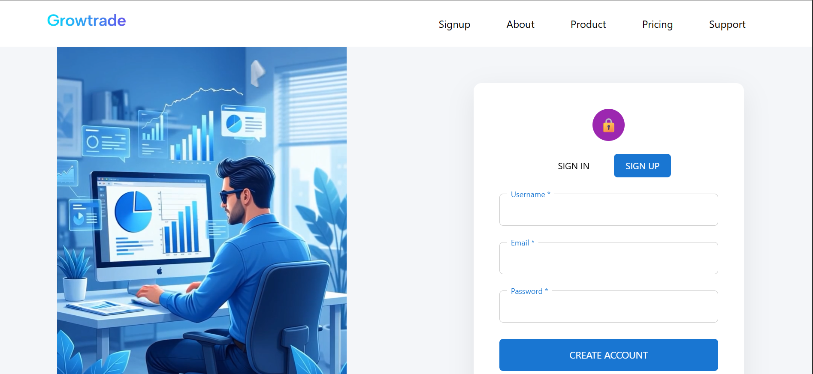
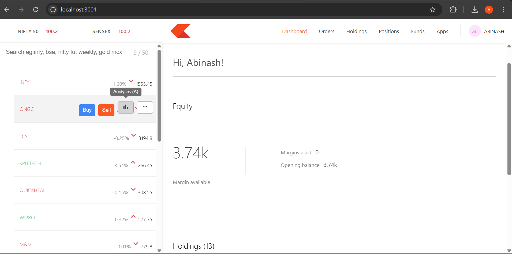

<!-- # GrowTrade 📈
### A Modern Full-Stack Stock Trading Platform

---

## 🚀 Project Overview

**GrowTrade** is a full-stack stock trading platform that simulates real-world trading workflows with a clean user experience and a powerful backend.  
It is built with a clear separation of **Frontend**, **Backend**, and **Dashboard**, ensuring scalability, modularity, and smooth real-time data flow.

The project demonstrates how production-grade web applications handle **authentication, data fetching, analytics dashboards, and secure APIs**.

---

## 🌐 Frontend Application

### 🛠 Technologies Used
- React.js
- JavaScript (ES6+)
- HTML5 & CSS3
- REST API Integration

### 🔍 What the Frontend Does
The frontend is the user-facing part of GrowTrade. It focuses on usability, smooth navigation, and a clean visual design.

**Key responsibilities:**
- User signup and login flow
- Product discovery and information pages
- Pricing and plan details
- Support and help access
- Communicating with backend APIs to fetch and display data

### 📄 Pages Included
- **Signup / Login Page** – Secure user authentication
- **Product Page** – Overview of platform features
- **Pricing Page** – Plan comparison and pricing details
- **Support Page** – User help and support information

---

### 🎥 Frontend Demo Video
> A complete walkthrough of the frontend user flow, navigation, and interactions.

https://github.com/your-username/growtrade/raw/main/assets/demo/frontend-demo.mp4

---

### 🖼 Signup Page Preview


---

## 📊 Dashboard (Admin / Analytics)

### 🛠 Technologies Used
- React.js
- REST APIs
- Data visualization patterns
- Modular component architecture

### 🔍 What the Dashboard Does
The dashboard is designed for **analytics and management**.  
It fetches **real data from the backend APIs** and presents it in a structured, readable format.

**Key responsibilities:**
- Fetching live data from backend services
- Displaying user holdings, positions, and orders
- Providing a clear analytics-style overview
- Acting as a control and monitoring panel

---

### 🎥 Dashboard Demo Video
> This video shows the dashboard fetching and rendering live data from backend APIs.

https://github.com/your-username/growtrade/raw/main/assets/demo/dashboard-demo.mp4

---

### 🖼 Dashboard Home Preview


---

## 🔗 Backend Integration

The backend acts as the **core engine** of GrowTrade.

- Built using RESTful API principles
- Handles authentication, business logic, and data persistence
- Manages communication between frontend/dashboard and the database
- Uses **secure environment variables** to protect sensitive information

**Data Flow:**
 -->


# GrowTrade 📈  
<p align="center">
  <b>A Modern Full-Stack Stock Trading Platform</b>
</p>

---

## ✨ Project Overview

> **GrowTrade** is a full-stack stock trading platform designed to demonstrate real-world **frontend, backend, and dashboard integration**.  
> Users can **buy and sell stocks, analyze prices, and manage holdings** through a powerful dashboard that fetches and displays data from **secure backend APIs**.

---

## 🌐 Frontend Application

### 🔗 Live Frontend Access

<p align="center">
  <a href="https://abinashgrowtrade.netlify.app/" target="_blank">
    
  </a>
</p>


<p align="center">
  <i>The user-facing experience of GrowTrade</i>
</p>

### 🛠 Tech Stack
<p>
  
  
  
  
</p>

### 🔍 What the Frontend Does

The frontend focuses on **usability, performance, and smooth navigation**, providing users with a clean and intuitive interface.

**Key Responsibilities:**
- 🔐 Secure user authentication (Signup / Login)
- 📦 Product and feature information
- 💳 Pricing plans and details
- 🆘 Support and help access
- 🔄 Fetching and rendering data from backend APIs

---

### 📄 Frontend Pages

| Page | Purpose |
|----|--------|
| 🔐 Signup / Login | User authentication |
| 📦 Product | Platform features |
| 💰 Pricing | Plan comparison |
| 🆘 Support | User assistance |

---

### 🎥 Frontend Demo

> **Live walkthrough of the frontend UI, navigation, and user journey**

📽️ **Demo Video:**  
assets/frontend_demo.mp4

---

### 🖼 Signup Page Preview

<p align="center">
  
</p>

---


## 📊 Dashboard (Admin / Analytics)

<p align="center">
  <i>Data-driven dashboard built on the MERN stack</i>
</p>

### 🔗 Live Dashboard Access

<p align="center">
  <a href="https://growtradedashboard.netlify.app/" target="_blank">
    
  </a>
</p>

### 🛠 Tech Stack
<p>
  
  
  
  
</p>

### 🔍 What the Dashboard Does

The dashboard is the **core interaction layer** of GrowTrade, built using the **MERN stack**.  
It allows users to **buy and sell stocks, analyze prices, and manage portfolios** using data fetched directly from backend APIs.

**Key Capabilities:**
- 📥 Fetching real-time data from the backend
- 📊 Displaying portfolio analytics and insights
- 🔄 Handling trading operations and data updates
- 🧩 Providing a structured and intuitive analytics UI

---

### 📂 Dashboard Modules

| Module | Description |
|------|------------|
| 📄 Orders | View and manage buy/sell orders |
| 📦 Holdings | Track owned stocks |
| 📈 Positions | Monitor active positions |
| 💰 Funds | Manage available balance |
| 🧩 Apps | Access dashboard utilities |

---

### 🎥 Dashboard Demo

> **Live demonstration of dashboard features and backend data integration**

📽️ **Demo Video:**  
assets/dashboard_demo.mp4

---

### 🖼 Dashboard Home Preview

<p align="center">
  
</p>

---

## 🔗 Backend Integration

<p align="center">
  <i>RESTful backend powering GrowTrade</i>
</p>

The backend is built using **Node.js and Express.js**, with **MongoDB** as the primary database.  
It acts as the **core engine** of the application, managing data flow, business logic, and security.

**Backend Responsibilities:**
- 🔐 User authentication and authorization
- 🔁 Handling REST API requests
- 🗄 Managing data storage with MongoDB
- 🔄 Serving data to frontend and dashboard securely
- 🛡 Protecting sensitive configuration using environment variables

---

### 🔄 Data Flow Architecture

```text
Frontend / Dashboard → Express.js APIs → MongoDB Database
